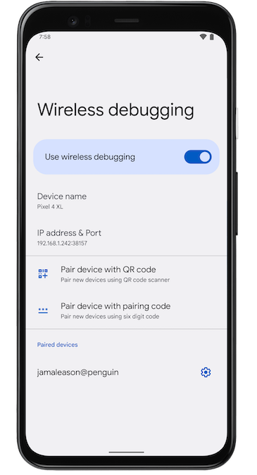

# Webscreen

## ℹ️ About

Webscreen is a self-hosted screen streaming web application for Android devices, based on WebRTC and [scrcpy](https://github.com/Genymobile/scrcpy).


It supports:
- Video, Audio, Control
- UHID Devices (Mouse, Keyboard, Gamepad)
- Clipboard Sync
- Maybe more...

It can run on:
- Android Termux
- Linux
- Windows
- MacOS

at both `amd64` and `arm64`

## Prerequisites
For device side, please refer to [scrcpy](https://github.com/Genymobile/scrcpy/blob/master/README.md#prerequisites)

For server side, you'd better have `adb` in your PATH first.

for client side, you only need a web browser.

Additionally, a [modified scrcpy-server](https://github.com/huonwe/scrcpy-0x63) is used.

## Usage
Download the latest [release](https://github.com/huonwe/webscreen/releases), execute the program. The default port is `8079`, but you can specifiy it by `./webscreen -port 8080`.
then open your favorite browser and visit `<your ip>:<your port>`

Or you can build by yourself. Normally, you can build simply by `go build`. But if you want to build by yourself on `Termux`, you need to run `go build -ldflags "-checklinkname=0"`.

You can also use docker:
```bash
docker run -d \
  --name webscreen \
  --network host \
  dukihiroi/webscreen:latest
```

`host` network mode is recommended because of UDP traffic.

You might need to pair Android device first. `Pair device with pairing code` is supported. Once you finished pairing, type `Connect` button and enter necessary information.

After you start streaming, you might need to manually make the scene a little changed, to get the screen. You can simply click volume button to make it.

Please notice that the ports in `pair` and `connect` are different.


