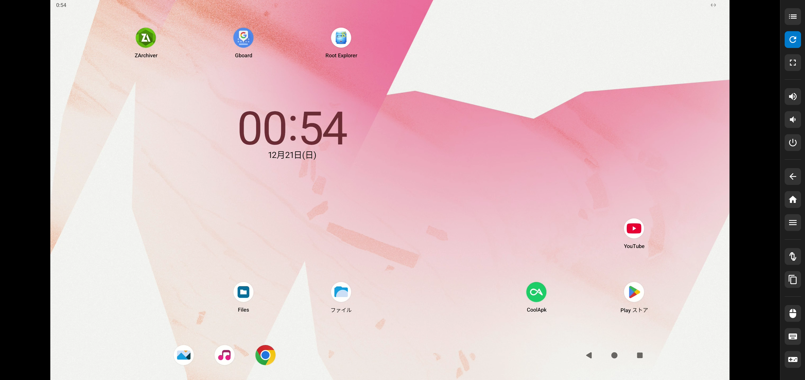

# Webscreen

## ℹ️ About

Webscreen is a self-hosted screen streaming web application for Android and Linux devices, based on WebRTC.


It can run on:

- Android Termux
- Linux
- Windows
- MacOS

at both `amd64` and `arm64`

Android supports ([scrcpy](https://github.com/Genymobile/scrcpy)):

- Video, Audio, Control
- UHID Devices (Mouse, Keyboard, Gamepad)
- Clipboard Sync
- Multi-finger, pressure
- H.264/H.265
- Maybe more...

Linux supports (xvfb):

- Video, Control

## Prerequisites

For device side, please refer to [scrcpy](https://github.com/Genymobile/scrcpy/blob/master/README.md#prerequisites)

For server side, you'd better have `adb` and `xvfb, ffmpeg (if need this feature)` in your PATH first.

```bash
# for Termux
pkg install android-tools
# clone the repo and build
git clone https://github.com/huonwe/webscreen.git
cd webscreen
go build -o sdriver/xvfb/bin/capturer_xvfb ./capturer
go build -ldflags "-checklinkname=0"

# for Debian
apt install adb
# if you want to stream xvfb display
apt install xvfb ffmpeg xfce4
# then you can directly use pre-built binary
```

**for client side, you need a web browser that support WebRTC (H.264 High Profile, or H.265 Main Profile).**

Additionally, a [modified scrcpy-server](https://github.com/huonwe/scrcpy-0x63) is used.

## Usage

Download the latest [release](https://github.com/huonwe/webscreen/releases), execute the program. The default port is `8079`, but you can specifiy it by `-port 8080`. 6-digit PIN is also needed (default to '123456'). An example command: `./webscreen -port 8080 -pin 555555`
Then open your favorite browser and visit `<your ip>:<your port>`

Or you can build by yourself. Normally, you can build simply by `go build`. But if you want to build by yourself on `Termux`, you need to run `go build -ldflags "-checklinkname=0"`.

You can also use docker:

```bash
docker run -d \
  --name webscreen \
  --network host \
  -e PORT=8079 \
  -e PIN=123456 \
  dukihiroi/webscreen:latest
```

`host` network mode is recommended because of UDP traffic.

You might need to pair Android device first. `Pair device with pairing code` is supported. Once you finished pairing, type `Connect` button and enter necessary information.

After you start streaming, you might need to manually make the scene a little changed, to get the screen. You can simply click volume button to make it.

Please notice that the ports in `pair` and `connect` are different. [See details here](https://developer.android.com/studio/debug/dev-options#enable)

## Known Issues

- UHID Mouse wouldn't work in some redroid images
- Xvfb wouldn't work in docker and termux
- termux can't use arm64 pre-built binary

## License

    Webscreen, streaming your device in Web browser.
    Copyright (C) 2025-2026  Hiroi

    This program is free software: you can redistribute it and/or modify
    it under the terms of the GNU Affero General Public License as published by
    the Free Software Foundation, either version 3 of the License, or
    (at your option) any later version.

    This program is distributed in the hope that it will be useful,
    but WITHOUT ANY WARRANTY; without even the implied warranty of
    MERCHANTABILITY or FITNESS FOR A PARTICULAR PURPOSE.  See the
    GNU Affero General Public License for more details.

    You should have received a copy of the GNU Affero General Public License
    along with this program.  If not, see <https://www.gnu.org/licenses/>.
